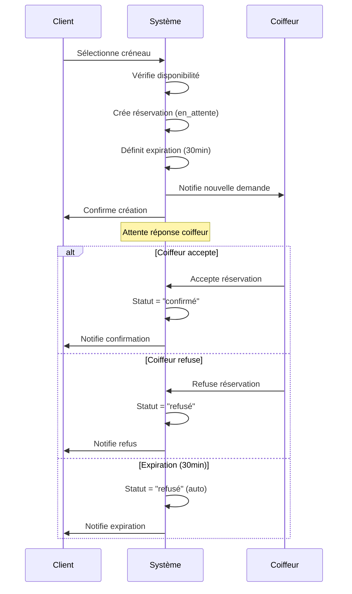

# SalonBook - Document de Spécifications Techniques

## Table des Matières
1. [Vue d'ensemble du projet](#vue-densemble-du-projet)
2. [Architecture système](#architecture-système)
3. [Cas d'utilisation détaillés](#cas-dutilisation-détaillés)
4. [Processus métier](#processus-métier)
5. [Modèle de données](#modèle-de-données)
6. [API et intégrations](#api-et-intégrations)
7. [Sécurité et authentification](#sécurité-et-authentification)
8. [Règles de gestion](#règles-de-gestion)
9. [Tests et validation](#tests-et-validation)
10. [Déploiement et maintenance](#déploiement-et-maintenance)

---

## 1. Vue d'ensemble du projet

### 1.1 Objectif
SalonBook est une plateforme de réservation en ligne pour salons de coiffure permettant aux clients de réserver des créneaux avec des professionnels qualifiés à Ottawa, Canada.

### 1.2 Périmètre fonctionnel
- **Gestion des utilisateurs** : Clients, Coiffeurs, Administrateurs
- **Système de réservation** : Création, validation, suivi des rendez-vous
- **Gestion des profils** : Professionnels avec spécialités et disponibilités
- **Administration** : Tableau de bord, statistiques, gestion des comptes

### 1.3 Contraintes techniques
- **Frontend** : React 18 + TypeScript + Tailwind CSS
- **Backend** : Supabase (PostgreSQL + Auth + RLS)
- **Déploiement** : Vercel/Netlify
- **Localisation** : Ottawa, Canada (EST/EDT)

---

## 2. Architecture système

### 2.1 Architecture globale
```
┌─────────────────┐    ┌─────────────────┐    ┌─────────────────┐
│   Frontend      │    │   Supabase      │    │   Services      │
│   (React/TS)    │◄──►│   (PostgreSQL)  │◄──►│   Externes      │
│                 │    │   + Auth + RLS  │    │                 │
└─────────────────┘    └─────────────────┘    └─────────────────┘
```

### 2.2 Composants principaux
- **Client Web** : Interface utilisateur responsive
- **API Gateway** : Supabase REST API
- **Base de données** : PostgreSQL avec RLS
- **Authentification** : Supabase Auth
- **Storage** : Supabase Storage (photos de profil)

---

## 3. Cas d'utilisation détaillés

### 3.1 Acteurs du système
- **Client** : Utilisateur final souhaitant réserver
- **Coiffeur** : Professionnel proposant ses services
- **Administrateur** : Gestionnaire de la plateforme

### 3.2 Cas d'utilisation - CLIENT

#### CU-01 : Inscription Client
**Acteur principal** : Client  
**Préconditions** : Aucune  
**Déclencheur** : Client souhaite créer un compte

**Scénario principal** :
1. Client accède à la page d'inscription
2. Client saisit : email, mot de passe, nom, prénom, téléphone
3. Système valide les données (format email, force mot de passe)
4. Système crée le compte avec rôle "client"
5. Système envoie email de confirmation
6. Client confirme son email
7. Système active le compte

**Scénarios alternatifs** :
- 3a. Email déjà utilisé → Message d'erreur
- 3b. Mot de passe faible → Message d'erreur avec critères

**Postconditions** : Compte client créé et activé

#### CU-02 : Recherche de Professionnels
**Acteur principal** : Client  
**Préconditions** : Aucune (accès libre)  
**Déclencheur** : Client recherche un coiffeur

**Scénario principal** :
1. Client accède à la page d'accueil
2. Client clique sur "Voir nos Experts" OU sélectionne un genre
3. Système affiche la liste des professionnels actifs
4. Client peut filtrer par :
   - Genre (homme/femme)
   - Spécialités
   - Note moyenne
   - Localisation
5. Système affiche les résultats filtrés

**Données affichées** :
- Photo, nom, spécialités, note, expérience, localisation

#### CU-03 : Réservation de Rendez-vous
**Acteur principal** : Client  
**Préconditions** : Professionnel sélectionné  
**Déclencheur** : Client clique sur "Réserver"

**Scénario principal** :
1. Client sélectionne un professionnel
2. Système affiche le calendrier de disponibilités
3. Client sélectionne une date disponible
4. Système affiche les créneaux horaires libres
5. Client sélectionne un créneau
6. Client saisit :
   - Service demandé
   - Commentaires (optionnel)
   - Informations personnelles si non connecté
7. Système vérifie la disponibilité
8. Système crée la réservation avec statut "en_attente"
9. Système définit expiration à 30 minutes
10. Système notifie le coiffeur
11. Système confirme la création au client

**Scénarios alternatifs** :
- 7a. Créneau déjà pris → Message d'erreur, retour étape 4
- 10a. Coiffeur non disponible → Réservation automatiquement refusée

**Postconditions** : Réservation créée en attente

#### CU-04 : Suivi des Réservations
**Acteur principal** : Client connecté  
**Préconditions** : Client authentifié avec réservations  
**Déclencheur** : Client accède à son dashboard

**Scénario principal** :
1. Client se connecte
2. Client accède à "Mes Réservations"
3. Système affiche les réservations du client :
   - En attente (avec temps restant)
   - Confirmées
   - Passées
   - Refusées/Annulées
4. Client peut voir les détails de chaque réservation
5. Client peut annuler une réservation confirmée

### 3.3 Cas d'utilisation - COIFFEUR

#### CU-05 : Connexion Coiffeur
**Acteur principal** : Coiffeur  
**Préconditions** : Compte coiffeur créé par admin  
**Déclencheur** : Coiffeur souhaite se connecter

**Scénario principal** :
1. Coiffeur accède à la page de connexion
2. Coiffeur saisit email et mot de passe
3. Système valide les identifiants
4. Système vérifie le rôle "coiffeur"
5. Système redirige vers le dashboard coiffeur

**Scénarios alternatifs** :
- 3a. Identifiants incorrects → Message d'erreur
- 4a. Compte inactif → Message d'erreur

#### CU-06 : Gestion des Réservations
**Acteur principal** : Coiffeur  
**Préconditions** : Coiffeur authentifié  
**Déclencheur** : Coiffeur accède à ses réservations

**Scénario principal** :
1. Coiffeur accède à son dashboard
2. Système affiche les réservations :
   - En attente (avec temps restant)
   - Confirmées du jour
   - Historique
3. Pour chaque réservation en attente, coiffeur peut :
   - Accepter → Statut "confirmé"
   - Refuser → Statut "refusé"
4. Système met à jour le statut
5. Système notifie le client

**Règles métier** :
- Délai de réponse : 30 minutes maximum
- Après expiration : réservation automatiquement refusée

#### CU-07 : Gestion du Profil Professionnel
**Acteur principal** : Coiffeur  
**Préconditions** : Coiffeur authentifié  
**Déclencheur** : Coiffeur modifie son profil

**Scénario principal** :
1. Coiffeur accède à "Mon Profil"
2. Coiffeur peut modifier :
   - Photo de profil
   - Spécialités
   - Description/Expérience
   - Horaires de travail
   - Tarifs par service
3. Coiffeur sauvegarde
4. Système valide les données
5. Système met à jour le profil

### 3.4 Cas d'utilisation - ADMINISTRATEUR

#### CU-08 : Gestion des Comptes Coiffeurs
**Acteur principal** : Administrateur  
**Préconditions** : Admin authentifié  
**Déclencheur** : Création/modification compte coiffeur

**Scénario principal** :
1. Admin accède à "Gestion Utilisateurs"
2. Admin clique sur "Créer Coiffeur"
3. Admin saisit :
   - Informations personnelles
   - Email et mot de passe temporaire
   - Spécialités
   - Statut (actif/inactif)
4. Système crée le compte avec rôle "coiffeur"
5. Système envoie les identifiants par email
6. Coiffeur doit changer son mot de passe à la première connexion

#### CU-09 : Supervision des Réservations
**Acteur principal** : Administrateur  
**Préconditions** : Admin authentifié  
**Déclencheur** : Consultation des statistiques

**Scénario principal** :
1. Admin accède au dashboard
2. Système affiche :
   - Nombre de réservations par statut
   - Taux de confirmation par coiffeur
   - Revenus estimés
   - Créneaux les plus demandés
3. Admin peut filtrer par période
4. Admin peut exporter les données

---

## 4. Processus métier

### 4.1 Processus de Réservation



### 4.2 Processus de Nettoyage Automatique

**Fréquence** : Toutes les 5 minutes  
**Déclencheur** : Tâche CRON ou fonction serverless

**Étapes** :
1. Système identifie réservations expirées
2. Statut "en_attente" + expires_at < NOW()
3. Suppression des réservations expirées
4. Libération des créneaux
5. Log des actions pour audit

---

## 5. Modèle de données

### 5.1 Entités principales

#### Table : users
```sql
CREATE TABLE users (
  id UUID PRIMARY KEY DEFAULT gen_random_uuid(),
  auth_id UUID REFERENCES auth.users(id),
  email TEXT NOT NULL,
  nom TEXT NOT NULL,
  prenom TEXT NOT NULL,
  telephone TEXT,
  role user_role DEFAULT 'client',
  status user_status DEFAULT 'actif',
  created_at TIMESTAMP WITH TIME ZONE DEFAULT NOW(),
  updated_at TIMESTAMP WITH TIME ZONE DEFAULT NOW()
);
```

#### Table : hairdressers
```sql
CREATE TABLE hairdressers (
  id UUID PRIMARY KEY DEFAULT gen_random_uuid(),
  auth_id UUID REFERENCES auth.users(id),
  name TEXT NOT NULL,
  email TEXT NOT NULL,
  phone TEXT,
  specialties TEXT[] DEFAULT '{}',
  experience TEXT,
  location TEXT DEFAULT 'Ottawa, ON',
  gender TEXT CHECK (gender IN ('male', 'female')),
  image_url TEXT,
  rating NUMERIC DEFAULT 0.0,
  is_active BOOLEAN DEFAULT true,
  created_at TIMESTAMP WITH TIME ZONE DEFAULT NOW(),
  updated_at TIMESTAMP WITH TIME ZONE DEFAULT NOW()
);
```

#### Table : bookings
```sql
CREATE TABLE bookings (
  id UUID PRIMARY KEY DEFAULT gen_random_uuid(),
  hairdresser_id UUID NOT NULL REFERENCES hairdressers(id),
  client_auth_id UUID REFERENCES auth.users(id),
  client_name TEXT NOT NULL,
  client_email TEXT NOT NULL,
  client_phone TEXT NOT NULL,
  service TEXT NOT NULL,
  booking_date DATE NOT NULL,
  booking_time TIME NOT NULL,
  status TEXT DEFAULT 'en_attente' CHECK (status IN ('en_attente', 'confirmé', 'refusé', 'terminé')),
  comments TEXT,
  expires_at TIMESTAMP WITH TIME ZONE,
  created_at TIMESTAMP WITH TIME ZONE DEFAULT NOW()
);
```

### 5.2 Relations et contraintes

#### Index et contraintes d'unicité
```sql
-- Éviter les doublons de réservation
CREATE UNIQUE INDEX idx_unique_booking 
ON bookings (hairdresser_id, booking_date, booking_time) 
WHERE status IN ('en_attente', 'confirmé');

-- Index pour les requêtes fréquentes
CREATE INDEX idx_bookings_hairdresser_date ON bookings (hairdresser_id, booking_date);
CREATE INDEX idx_bookings_client ON bookings (client_auth_id);
CREATE INDEX idx_bookings_status ON bookings (status);
```

---

## 6. API et intégrations

### 6.1 Endpoints Supabase

#### Authentification
- `POST /auth/v1/signup` - Inscription
- `POST /auth/v1/signin` - Connexion
- `POST /auth/v1/signout` - Déconnexion
- `POST /auth/v1/recover` - Récupération mot de passe

#### Données métier
- `GET /rest/v1/hairdressers` - Liste des coiffeurs
- `POST /rest/v1/bookings` - Créer réservation
- `PATCH /rest/v1/bookings?id=eq.{id}` - Modifier réservation
- `GET /rest/v1/bookings` - Lister réservations

### 6.2 Hooks personnalisés

#### useSupabaseAuth
```typescript
interface AuthState {
  user: User | null;
  loading: boolean;
  isAuthenticated: boolean;
  signIn: (email: string, password: string) => Promise<AuthResult>;
  signUp: (email: string, password: string, metadata?: object) => Promise<AuthResult>;
  signOut: () => Promise<void>;
}
```

#### useNewSupabaseBookings
```typescript
interface BookingHook {
  createBooking: (data: BookingData) => Promise<Result>;
  getBookingsForHairdresser: (id: string) => Promise<Booking[]>;
  updateBookingStatus: (id: string, status: BookingStatus) => Promise<void>;
  loading: boolean;
}
```

---

## 7. Sécurité et authentification

### 7.1 Row Level Security (RLS)

#### Politique bookings
```sql
-- Coiffeurs voient leurs réservations
CREATE POLICY "hairdresser_view_bookings" ON bookings
  FOR SELECT TO authenticated
  USING (hairdresser_id IN (
    SELECT id FROM hairdressers WHERE auth_id = auth.uid()
  ));

-- Clients voient leurs réservations
CREATE POLICY "client_view_own_bookings" ON bookings
  FOR SELECT TO authenticated
  USING (client_auth_id = auth.uid());
```

### 7.2 Validation des données

#### Côté frontend
- Validation des emails (regex)
- Validation des téléphones (format canadien)
- Validation des créneaux (horaires ouvrables)
- Sanitisation des inputs

#### Côté base de données
- Contraintes CHECK sur les statuts
- Contraintes de clés étrangères
- Validation des formats via triggers

---

## 8. Règles de gestion

### 8.1 Règles de réservation

1. **Délai de réservation** : Minimum 2h à l'avance
2. **Durée des créneaux** : 30 minutes minimum
3. **Expiration** : 30 minutes pour répondre
4. **Annulation** : Possible jusqu'à 24h avant
5. **Modification** : Impossible, doit annuler et recréer

### 8.2 Règles de validation

1. **Horaires** : 9h-19h en semaine, 9h-18h samedi, fermé dimanche
2. **Créneaux simultanés** : 1 seul par coiffeur
3. **Réservations futures** : Maximum 30 jours
4. **Comptes multiples** : 1 email = 1 compte

### 8.3 Règles de notification

1. **Création réservation** : Email au coiffeur
2. **Confirmation** : Email au client
3. **Refus** : Email au client avec suggestions
4. **Rappel** : 24h avant le rendez-vous
5. **Expiration** : Notification temps réel

---

## 9. Tests et validation

### 9.1 Tests unitaires

#### Composants à tester
- `useAuth` - Authentification
- `useBookings` - Gestion réservations
- `HairdresserCard` - Affichage profils
- `BookingCalendar` - Sélection créneaux

#### Cas de test
```typescript
describe('useAuth', () => {
  it('should authenticate valid user', async () => {
    const { result } = renderHook(() => useAuth());
    const response = await result.current.signIn('test@example.com', 'password123');
    expect(response.success).toBe(true);
  });
});
```

### 9.2 Tests d'intégration

#### Scénarios critiques
1. **Flux de réservation complet**
2. **Expiration automatique**
3. **Notifications en temps réel**
4. **Synchronisation multi-utilisateurs**

### 9.3 Tests de performance

#### Métriques cibles
- Temps de chargement < 2s
- Première interaction < 1s
- Réactivité temps réel < 500ms
- Disponibilité > 99.5%

---

## 10. Déploiement et maintenance

### 10.1 Environnements

#### Développement
- **URL** : localhost:5173
- **Base** : Supabase projet dev
- **Auth** : Comptes de test

#### Production
- **URL** : salonbook.lovable.app
- **Base** : Supabase projet prod
- **Auth** : Comptes réels
- **Monitoring** : Logs activés

### 10.2 Stratégie de déploiement

```yaml
# .github/workflows/deploy.yml
name: Deploy to Production
on:
  push:
    branches: [main]
jobs:
  deploy:
    runs-on: ubuntu-latest
    steps:
      - uses: actions/checkout@v2
      - name: Build & Deploy
        run: |
          npm install
          npm run build
          npm run deploy
```

### 10.3 Monitoring et maintenance

#### Métriques à surveiller
- Taux d'erreur API
- Temps de réponse
- Nombre d'utilisateurs actifs
- Taux de conversion réservations

#### Maintenance préventive
- Nettoyage données expirées (quotidien)
- Backup base de données (quotidien)
- Mise à jour dépendances (mensuel)
- Audit sécurité (trimestriel)

---

## Annexes

### A. Glossaire

- **RLS** : Row Level Security - Sécurité au niveau des lignes
- **JWT** : JSON Web Token - Token d'authentification
- **CRUD** : Create, Read, Update, Delete
- **API** : Application Programming Interface
- **UI/UX** : User Interface / User Experience

### B. Références

- [Documentation Supabase](https://supabase.com/docs)
- [Documentation React](https://reactjs.org/docs)
- [Guide Tailwind CSS](https://tailwindcss.com/docs)
- [Standards REST](https://restfulapi.net/)

### C. Contacts

- **Équipe technique** : dev@salonbook.ca
- **Support client** : support@salonbook.ca
- **Administration** : admin@salonbook.ca

---

**Version** : 1.0  
**Date** : 2 juillet 2025  
**Auteur** : Équipe SalonBook  
**Statut** : Document de référence
